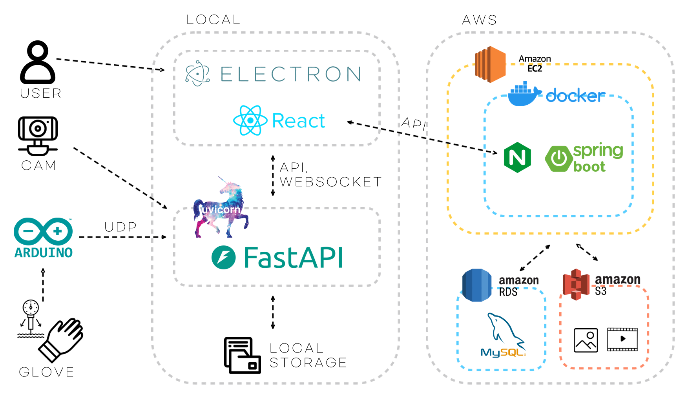

  

 

 

## 📖 프로젝트 개요 (Overview)

**웹캠과 센서 장갑을 통해 현실 공간과 디지털 사운드를 결합하여 새로운 음악적 경험을 제공하는 시스템**

**기간** 2025.07 - 2025.08  
**인원** 6인

 

## 🚀 주요 기능 (Key Features)

-   **🎹 실시간 터치 사운드 (Touch Sound)**: YOLO와 MediaPipe로 객체와 손가락을 실시간 인식하고, FSR 센서 장갑의 압력을 감지하여 사물 터치 시 매핑된 사운드를 즉시 출력
-   **🔁 루프 스테이션 (Loop Station)**: 연주한 사운드를 실시간으로 녹음하고 여러 트랙의 루프를 중첩시켜 즉석에서 새로운 비트와 멜로디 구성 가능
-   **🌐 커뮤니티 & 공유 (Community & Sharing)**: 자신의 연주 영상을 업로드하고 공유하여 다른 사용자들의 작품을 감상하고 피드백을 주고받을 수 있는 소셜 기능을 제공

 

## 🏛️ 시스템 아키텍처 (System Architecture)

본 프로젝트는 **성능과 기능 분리**를 위해 두 개의 독립적인 시스템으로 구성된 하이브리드 아키텍처 채택

  

### 1. 로컬 실시간 처리 시스템 (Electron + Python)
> **지연을 최소화**하여 악기 연주의 핵심인 '실시간성'을 확보하기 위해 로컬 환경에서 실행되도록 설계

-   **`Electron (React)`**: 사용자 인터페이스(UI)와 시스템의 전체적인 흐름 제어
-   **`Python (FastAPI)`**: AI 모델(YOLO, MediaPipe)을 서빙하고, 웹캠 영상 처리 및 실시간 통신(WebSocket) 담당
-   **`ESP32 (Sensor Glove)`**: FSR 센서로 감지한 손가락의 압력 값을 UDP 소켓 통신을 통해 Python 백엔드로 실시간 전송

`[센서 장갑 (ESP32)] --(UDP)--> [Python Backend] <--(WebSocket)--> [Electron Frontend] --> [스피커]`

### 2. 웹 기반 커뮤니티 시스템 (Spring Boot + AWS)
> 영상 공유, 사용자 인증 등 **웹 기반 기능**을 위해 안정적이고 확장 가능한 서버 환경으로 구축하고 AWS에 배포

-   **`Spring Boot`**: 커뮤니티 기능의 핵심 비즈니스 로직과 API를 담당
-   **`MySQL`**: 사용자 정보, 게시글, 영상 데이터 등을 저장 및 관리
-   **`JWT & OAuth2`**: 안전한 사용자 인증 및 간편한 소셜 로그인 기능 구현

 

## 🛠️ 기술 스택 (Tech Stack)

| 구분                | 기술                                                                     |
| :------------------ | :----------------------------------------------------------------------- |
| **Frontend**        | `React 19`, `Electron`, `Vite`, `Konva.js`, `Zustand`, `React Router`     |
| **AI Backend**      | `Python 3.10`, `FastAPI`, `WebSocket`                                    |
| **AI / ML**         | `OpenCV`, `Ultralytics YOLO`, `MediaPipe`, `YOLOv8s-seg`                   |
| **Community Backend**| `Spring Boot`, `Java 17`, `JWT`, `OAuth2`                                |
| **Database**        | `MySQL`                                                                  |
| **Embedded / IoT**  | `ESP32-WROOM-32`, `FSR Sensor`, `Arduino (C/C++)`, `UDP Socket`          |
| **Infra**           | `AWS`, `Docker`, `Nginx`                                                   |

 

## ✨ 핵심 동작 원리 (How It Works)

**'터치 사운드'** 기능은 다음과 같은 정밀한 단계를 거쳐 구현됩니다.
1.  **객체 탐지 (Object Detection)**: `YOLO` 모델이 웹캠 영상에서 사용자가 등록한 사물의 위치와 영역(Bounding Box)을 지속적으로 추적합니다.
2.  **손가락 추적 (Hand Tracking)**: `MediaPipe` 모델이 사용자의 손을 인식하고, 특히 검지손가락 끝의 좌표를 실시간으로 추적합니다.
3.  **터치 압력 감지 (Touch Pressure Detection)**: 사용자가 `센서 장갑`을 낀 손가락으로 사물을 터치하면, FSR 센서가 압력을 감지하여 즉시 UDP 신호를 Python 백엔드로 전송합니다.
4.  **최종 판정 및 사운드 출력**: 백엔드는 UDP 신호를 수신하는 순간, **'검지손가락 끝 좌표가 특정 사물의 Bounding Box 내부에 있는지'**를 판단합니다. 조건이 참일 경우, 해당 사물에 매핑된 사운드를 Electron 앱을 통해 출력합니다.

 

## 👨‍💻 팀원 (Team 북치고 코드치고)

| 이름     | 역할              |
| :------- | :---------------- | 
| **김동현** | **팀장, Frontend**  | 
| **김구**   | **AI**        |
| **이강규** | **AI**        |
| **김규현** | **Backend**    |
| **서유빈** | **Embedded**      |
| **장수연** | **Infra, Backend**     |
